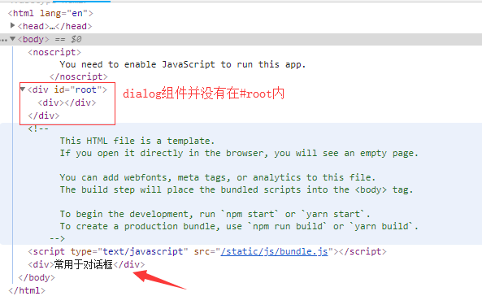

## 目录
* branch:master <a href="#">reactjs API速览</a>
* branch:redux  <a href="https://github.com/1uokun/react-dom-cli/tree/redux">redux笔记</a>
* branch:router  <a href="https://github.com/1uokun/react-dom-cli/tree/router">redux与router实践</a>

## 创建组件的三种代码形式
1.**React.createClass**

 ⚠️16版本后弃用
```javascript
var MyComponent = React.createClass({
    render(){
        return <div>
                    <h1>Hello World!</h1>
                    <p>This is my first React Component</p>
               </div>
    }
})
```
2.**class**

也是最常用的
```javascript
class MyComponent extends React.Component {
    render(){
        return <div>...</div>
    }
}
```
 3.**无状态功能组件**

也称哑巴组件，常用于展示静态UI组件，只接收数据不做任何操作，如导航栏
```javascript
const MyComponent = () => {
    return <div>...</div>
}
```

## props.children

```javascript
class Layout extends Component {
    render(){
        return (
            <header>
                {this.props.children[0]}
            </header>
            <article>
                {this.props.children[1]}
            </article>
            <footer>
                {this.props.children[2]}
            </footer>
        )
    }
}
//使用
<Layout>
    <header>
        <div>header</div>
    </header>
    <article>
        <div>article</div>
    </article>
    <footer>
        <div>footer</div>
    </footer>
</Layout>
```

## PropTypes

```javascript
import PropTypes from 'prop-types'
//方式一，组件内
static propTypes = {
	comment: PropTypes.object
}
//方式二，组件外
WrapperComponent.propTypes={
	comment: PropTypes.object
}
/*
PropTypes.element.isRequired
*/
```

## React.createRef()
> ref

```javascript
    <TextInput
    	ref={c=>{
    		this._textInput = c;
    		this._root = c;
    	}}
    />
    this._textInput.focus()

    //基于TextInput封装的Input
    <Input ref={(ref)=>{this.myInput=ref;}} />
    this.myInput._root.focus()
```

> 子组件ref传递给父组件

```javascript
function CustomTextInput(props) {
  return (
    <div>
      <input ref={props.inputRef} />
    </div>
  );
}

class Parent extends React.Component {
  constructor(props) {
    super(props);
    this.inputElement = React.createRef();
  }
  render() {
    return (
      <CustomTextInput inputRef={this.inputElement} />
    );
  }
}

// 使用
this.inputElement.current.focus();
```
https://reactjs.org/docs/refs-and-the-dom.html#exposing-dom-refs-to-parent-components

> forwarding-refs

```javascript
const WrappedComponent = React.forwardRef((props, ref) => {
    return <LogProps {...props} forwardedRef={ref} />
})
```
***使用场景***：通过`HOC`生成组件时，被包装的组件`ref`是不会被传递，因为`ref`不是`prop`，而是类似`key`。所以如果将引用添加到`HOC`，则引用将引用最外面的容器组件，而不是内部的包装组件，这时就需要`forwarding`传递`ref`

## React.Fragment
> 减少不必要的DOM开销

```html
<Fragment>
	<li></li>
	<li></li>
</Fragment>
```

## React.createContext()
> const {Provider,Consumer} = React.createContext()

### 传递值 ###

```javascript
//Provider 提供者
class App extends Component {
	render(){
		return(
		<Provider value="这个值可以用Consumer组件拿到，无需使用props一层一层地传递">
			<Button />
		</Provider>
		)
	}
}

//Consumer 接收者
class Button extends Component {
	render(){
		return (
		<Consumer>
			{value=><button>{value}</button>} //这个值可以用Consumer组件拿到，无需使用props一层一层地传递
		</Consumer>
		)
	}
}
```

### 传递事件 ###

```javascript
class App extends Component {
	method=(e)=>{
		this.setState({data:e})
	}
	render(){
		return (
		<Provider value={{click:this.method}}>
			<Button />
		</Provider>
		)
	}
}

class Button extends Component {
	render(){
		return (
		<Consumer>
			{({click})=><button onclick={()=>click('asd')}>传递事件</button>}
		</Consumer>
		)
	}
}
```

### 多个context ###

```javascript
const Context1 = React.create({...})	//使用：<Context1.Provider></Context1.Provider>
const Context2 = React.create({...})	//使用：<Context1.Consumer></Context1.Consumer>
```
## componentDidCatch
> 处理错误的生命周期
> https://segmentfault.com/a/1190000011379425

## ReactDOM.createPortal()
> ReactDOM.createPortal(child, container) 常用于“对话框”组件
> https://zhuanlan.zhihu.com/p/29880992?utm_source=wechat_session&utm_medium=social&from=singlemessage

```javascript
class Dialog extends React.Component {
    constructor() {
        super(...arguments);

        const doc = window.document;
        this.node = doc.createElement('div');
        doc.body.appendChild(this.node);
    }

    render() {
        return createPortal(
            <Fragment>
                {this.props.children}
            </Fragment>, //塞进传送门的JSX
            this.node //传送门的另一端DOM node
        );
    }

    componentWillUnmount() {
        window.document.body.removeChild(this.node);
    }
}
```


## Uncontrolled Components
> 表单控件属性 应使用Form File API

### \<input type="text" />

```
    //this.input.value 获取值
    <input type="text" ref={(input) => this.input = input} />
    //defaultValue 避免生命周期中渲染值
    <input defaultValue="asd">
```
### \<input type="file"/>

```
    //this.fileInput.files[0].name 获取文件名
    <input type="file" ref={(input) => this.fileInput = input;} />
```

### \<form />

```
    handleSubmit(event){
    	event.preventDefault();
    	...
    }
    <form onSubmit={this.handleSubmit}>
    </form>
    //dom操作用document.getElementById("myform").submit()
```

## Smart/Dumb Components
 - **Dumb Component 哑巴组件（现称演示组件）**：
  - 没有state,只有props.children，
  - 仅接收数据和回调，不存在异步加载
  - 常见于UI层的侧边栏，列表，导航等静态显示区
  - 可用函数形式生成
 - **Smart Component 智能组件（现称容器组件）**
  - 有state，往往充当数据源
  - 通过Flux操作
  - 通常使用高阶组件生成
[演示和容器组件-把它们放在两个文件夹中](https://medium.com/@dan_abramov/smart-and-dumb-components-7ca2f9a7c7d0)